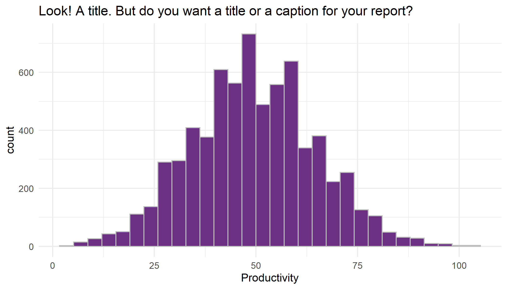
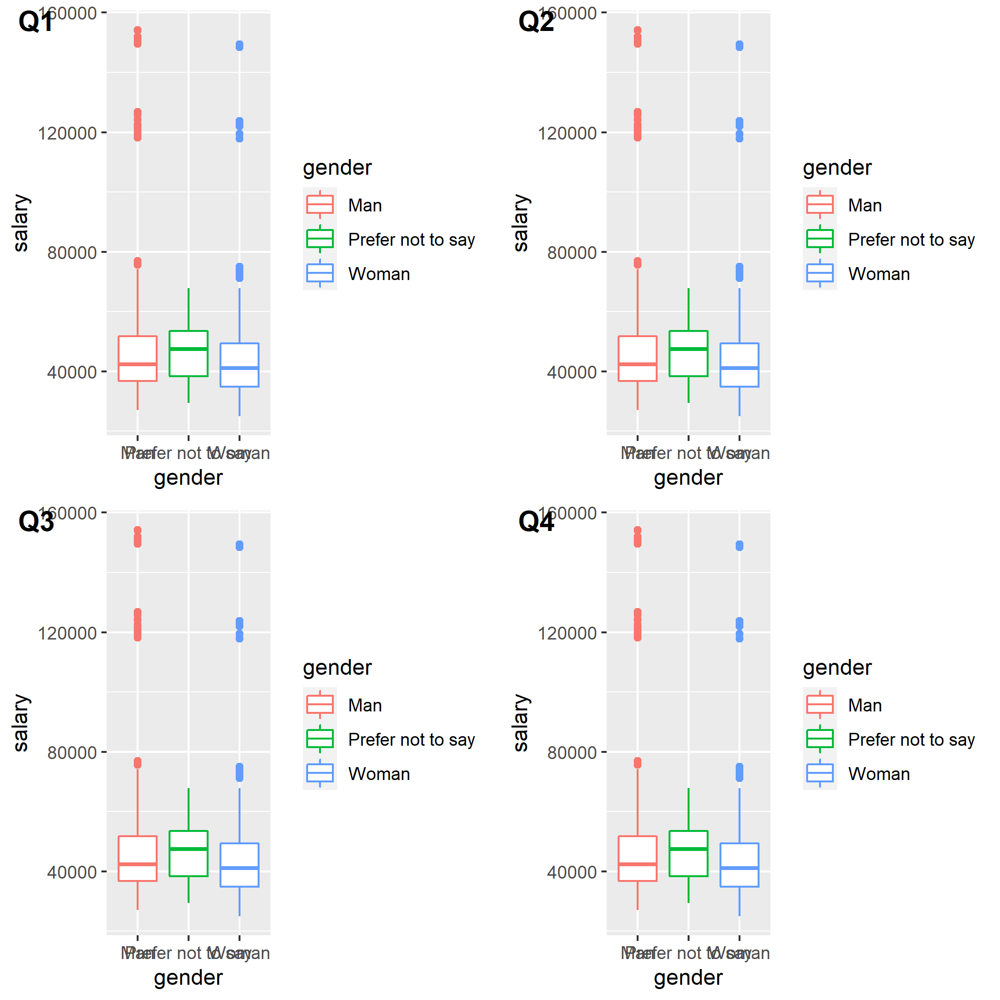
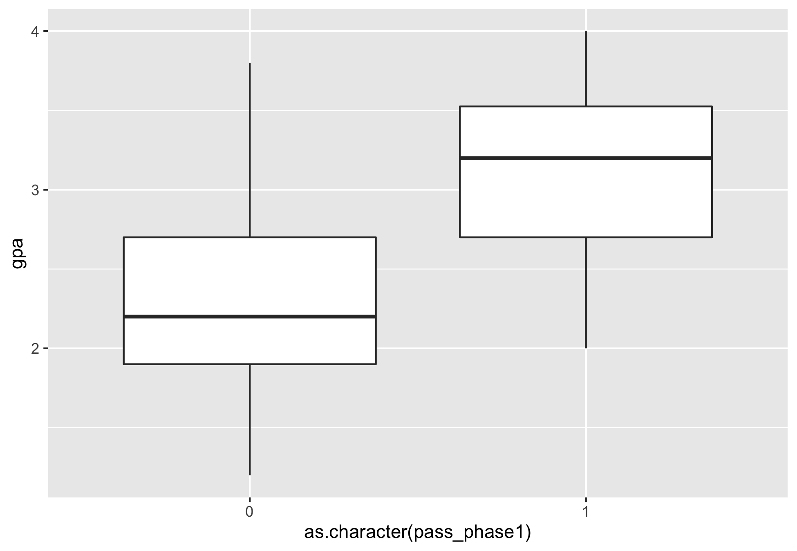
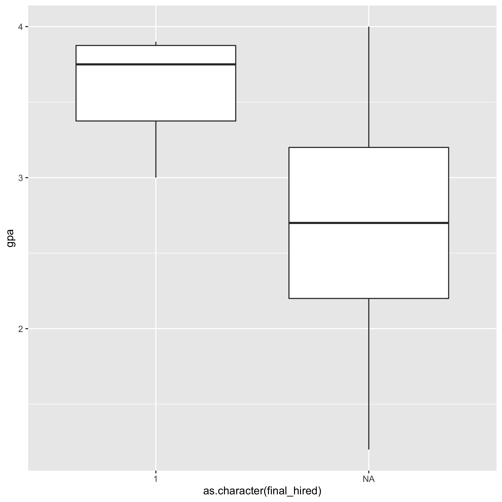
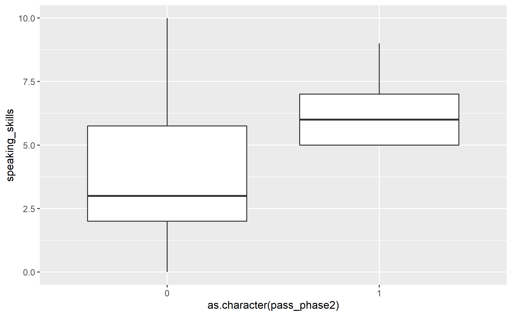
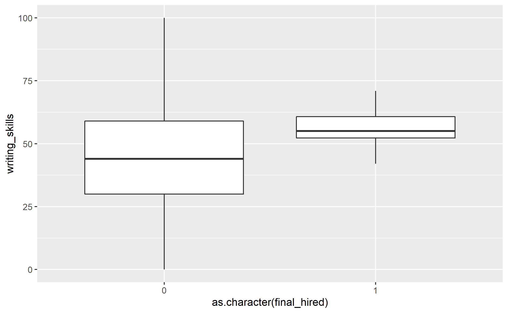
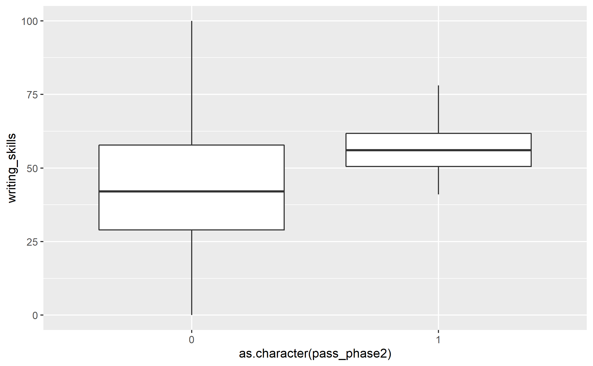
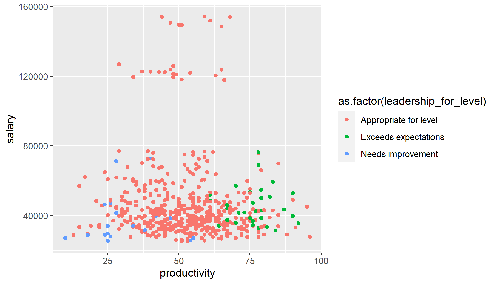
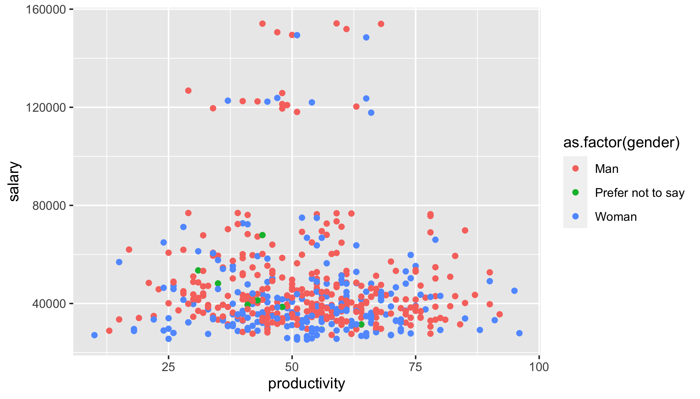

```{r, message = FALSE, echo=FALSE}
#install.packages("gridExtra")
#install.packages("tidyverse")
#install.packages("lmtest")
library(lmtest)
library(tidyverse)
library(cowplot)
# this should supress all code and messages
knitr::opts_chunk$set(include=FALSE,echo = TRUE)
```

# General comments (you can delete this section)

_You can delete this section, and if you want to check what it said, just open a template from the package again. You don't have to use this particular template, but you DO need to write you report in RMarkdown and include a cover page._

_The cover page must have:_

*	_A title and subtitle_
* _"Report prepared for Black Saber Software by" your company name_
*	_Date (assessment submission date is fine)_

_You can change the colour of this cover to any colour you would like by replacing 6C3082 in the YAML above (line 11) to another hex code. You could use this tool to help you:_ https://htmlcolorcodes.com/color-picker/

\newpage
# Executive summary

_Guidelines for the executive summary:_

* _No more than two pages_
* _Language is appropriate for a non-technical audience_
* _Bullet points are used where appropriate_
*	_A small number of key visualizations and/or tables are included_
*	_All three research questions are addressed_


\newpage
# Technical report
_This part of the report is much more comprehensive than the executive summary. The audience is statistics/data-minded people, but you should NOT include code or unformatted R output here._


## Introduction

_Provide a brief introduction to your report and outline what the report will cover. This section is valuable for setting scope and expectations. _

### Research questions
_Use bullet points to to describe the research questions you are going to address. Write in full sentences._

## Informative title for section addressing a research question

_For each research question, you will want to briefly describe any data manipulation, show some exploratory plots/summary tables, report on any methods you use (i.e. models you fit) and the conclusions you draw from these_

```{r}
# This chunk provides an example of some things you can do with RMarkdown to make your report creation process easier

# read in the data
black_saber_current_employees <- read_csv("data/black-saber-current-employees.csv")

# create a visualisation
my_plot <- black_saber_current_employees %>% 
  ggplot(aes(x = productivity)) +
  geom_histogram(colour = "grey", fill = "#6C3082") +
  theme_minimal() +
  labs(title = "Look! A title. But do you want a title or a caption for your report?", x = "Productivity")

# save your plot in your images folder, you can specify the height and width, too
# saving this means you can add the image to your exectuve summary without having to run or rerun the code, if you wish
ggsave("images/example.png", width = 7, height = 4)

# norice how the image is included with the  below
```



## Informative title for section addressing a research question
## Informative title for section addressing a research question

```{r, include = FALSE}
library(tidyverse)
library(lme4)
```


## Import Data
```{r}
black_saber_current_employees <- read_csv("data/black-saber-current-employees.csv")
final_hires <- read_csv("data/final-hires-newgrad_2020.csv")
phase1_new_applicants <- read_csv("data/phase1-new-grad-applicants-2020.csv")
phase2_new_applicants <- read_csv("data/phase2-new-grad-applicants-2020.csv")
phase3_new_applicants <- read_csv("data/phase3-new-grad-applicants-2020.csv")
```

employee_id, gender, team, financial_q, role_seniority, leadership_for_level, productivity, salary
```{r}
black_saber_current_employees
```
applicant_id (final_hires)
```{r}
final_hires
```
applicant_id, team_applied_for, cover_letter, cv, gpa, gender, extracurriculars, work_experience
```{r}
phase1_new_applicants
```

applicant_id, technical_skills, writing_skills, speaking_skills, leadership_presence
```{r}
phase2_new_applicants
```

applicant_id, interviewer_rating_1, interviewer_rating_2
```{r}
phase3_new_applicants
```

## Data Cleaning

Current Employee
```{r}
black_saber_current_employees$salary <- as.numeric(gsub('[$,]','',black_saber_current_employees$salary))
```

Applicants
```{r}
# If the applicant is hired, final_hired = 1, otherwise final_hired = NA.
final_hires <- final_hires %>% mutate(final_hired = 1)

# If the applicant passed phase1, pass_phase1 = 1, otherwise = NA.
phase2_temp <- phase2_new_applicants %>% select(applicant_id, technical_skills) %>% rename(pass_phase1 = technical_skills) %>% mutate(pass_phase1 = 1)

# If the applicant passed phase2, pass_phase2 = 1, otherwise = NA.
phase3_temp <- phase3_new_applicants %>% select(applicant_id, interviewer_rating_1) %>% rename(pass_phase2 = interviewer_rating_1) %>% mutate(pass_phase2 = 1)

phase1_new_applicants <- phase1_new_applicants %>% merge(final_hires, by = "applicant_id", all = TRUE) %>% merge(phase2_temp, by = "applicant_id", all = TRUE) 

phase1_new_applicants <- phase1_new_applicants %>% mutate(pass_phase1 = ifelse(is.na(pass_phase1), 0, 1)) %>% mutate(final_hired = ifelse(is.na(final_hired), 0, 1)) 

phase2_new_applicants <- phase2_new_applicants %>% merge(final_hires, by = "applicant_id", all = TRUE)%>% merge(phase3_temp, by = "applicant_id", all = TRUE)

phase2_new_applicants <- phase2_new_applicants %>% mutate(pass_phase2 = ifelse(is.na(pass_phase2), 0, 1)) %>% mutate(final_hired = ifelse(is.na(final_hired), 0, 1)) 

phase2_temp1 <- phase2_new_applicants %>% select(-final_hired, -pass_phase2)

phase3_new_applicants <- phase3_new_applicants %>% merge(final_hires, by = "applicant_id", all = TRUE) %>% inner_join(phase2_temp1, by = "applicant_id")

phase3_new_applicants <- phase3_new_applicants %>% mutate(final_hired = ifelse(is.na(final_hired), 0, 1)) 

```


## Data Visualization


Part 1 on current employee data 
findings: 
1. fixing quarter, men on avg earn more
2. lower leadership associated with lower productivity and lower salary
3. leadership exceeding expectation does not lead to higher salary
4. productivity follows pyramid shape with role seniorities
5. higher/more senior roles, higher salary 
6. for the same productivity, men on avg earn more
7. fixing quarter, across diff levels (entry to manager) men are always the ones receiving highest salary within their team 
8. for leadership, almost all "exceed expecation" are men and all "needs improvement" are women
9. for the same role, men earn more 
10. for the same team, men earn more 

#research question 
-is there gender bias in current employee remuneration? 
  -fixing team/productivity/quarter/role, men earn more 
  -need improvement: all women, exceed expectation: all men
-general info   
  -lower leadership associated with lower productivity and lower salary
  -leadership exceeding expectation does not lead to higher salary
  -productivity follows pyramid shape with role seniorities
  
--model interest 
  -y:salary x: gender, seniority, team, leadership, productivity, quarter, id 
  -main interest: salary ~ gender
  -fixed effect: gender, seniority, quarter 
  -random effect: team, leadership, productivity 
  -y: continuous, don't need generalized, -> linear mixed model? 
  
  -model breakdown 
    -full model of salary~gender
    -reduced model (eg. take out productivity)
    -model comparison 
    -use random effect vs. random slope 
    
    -other models 
    -seniority ~ gender
    -leadership ~ gender 
  

### Salary distribution for men and women in each quarter

```{r}
#edit axis label (name)
salary_by_gender_q1 <- black_saber_current_employees %>% filter(substring(financial_q, nchar(financial_q)) == '1') %>% ggplot(aes(x = gender, y = salary)) + geom_boxplot(aes(colour = gender))
salary_by_gender_q2 <- black_saber_current_employees %>% filter(substring(financial_q, nchar(financial_q)) == '1') %>% ggplot(aes(x = gender, y = salary)) + geom_boxplot(aes(colour = gender))
salary_by_gender_q3 <- black_saber_current_employees %>% filter(substring(financial_q, nchar(financial_q)) == '1') %>% ggplot(aes(x = gender, y = salary)) + geom_boxplot(aes(colour = gender))
salary_by_gender_q4 <- black_saber_current_employees %>% filter(substring(financial_q, nchar(financial_q)) == '1') %>% ggplot(aes(x = gender, y = salary)) + geom_boxplot(aes(colour = gender))
gender_salary <- plot_grid(salary_by_gender_q1, salary_by_gender_q2, salary_by_gender_q3, salary_by_gender_q4, labels = c("Q1","Q2","Q3","Q4"), ncol = 2, nrow = 2)
ggsave("images/gender_salary.png", gender_salary)
```


### salary difference across leadership, seniority, and gender for level, fixing productivity

```{r, message=FALSE}
black_saber_current_employees %>% 
  filter(financial_q == '2020 Q1') %>% 
  group_by(employee_id) %>% 
  ggplot(aes(x = productivity, y = salary, color = as.factor(leadership_for_level)))+
  geom_point()
ggsave("images/leadership_salary_Q1.png", width = 7, height = 4)

black_saber_current_employees %>% 
  filter(financial_q == '2020 Q1') %>% 
  group_by(employee_id) %>% 
  ggplot(aes(x = productivity, y = salary, color = as.factor(role_seniority)))+
  geom_point()
ggsave("images/level_salary_Q1.png", width = 7, height = 4)

black_saber_current_employees %>% 
  filter(financial_q == '2020 Q1') %>% 
  group_by(employee_id) %>% 
  ggplot(aes(x = productivity, y = salary, color = as.factor(gender)))+
  geom_point()
ggsave("images/level_salary_Q1.png", width = 7, height = 4)
```


### salary difference in gender across teams, fixing quarter and seniority 

```{r}
black_saber_current_employees %>% 
  filter(financial_q == '2020 Q4') %>% 
  filter(role_seniority == 'Entry-level') %>% 
  group_by(employee_id) %>% 
  ggplot(aes(x = team, y = salary, color = as.factor(gender)))+
  geom_point()
#ggsave("images/leadership_salary_Q1.png", width = 7, height = 4)

black_saber_current_employees %>% 
  filter(financial_q == '2020 Q4') %>% 
  filter(role_seniority == 'Junior I') %>% 
  group_by(employee_id) %>% 
  ggplot(aes(x = team, y = salary, color = as.factor(gender)))+
  geom_point()

black_saber_current_employees %>% 
  filter(financial_q == '2020 Q4') %>% 
  filter(role_seniority == 'Senior I') %>% 
  group_by(employee_id) %>% 
  ggplot(aes(x = team, y = salary, color = as.factor(gender)))+
  geom_point()

black_saber_current_employees %>% 
  filter(financial_q == '2020 Q4') %>% 
  filter(role_seniority == 'Manager') %>% 
  group_by(employee_id) %>% 
  ggplot(aes(x = team, y = salary, color = as.factor(gender)))+
  geom_point()

```
```{r}
black_saber_current_employees %>% 
  group_by(employee_id) %>% 
  ggplot(aes(x = leadership_for_level, y = salary, color = as.factor(gender)))+
  geom_point()

black_saber_current_employees %>% 
  group_by(employee_id) %>% 
  ggplot(aes(x = role_seniority, y = salary, color = as.factor(gender)))+
  geom_point()

black_saber_current_employees %>% 
  group_by(employee_id) %>% 
  ggplot(aes(x = team, y = salary, color = as.factor(gender)))+
  geom_point()
```

```{r}
# The main model examine the gender bias, along with other potential biases in current employee remuneration
# fixed effect: gender, seniority, quarter 
# random effect: team, leadership, productivity 
model1 <- lmer(salary ~ gender + role_seniority + financial_q + (1|team) + (1| leadership_for_level) + (1|productivity), data = black_saber_current_employees)
summary(model1)
```
```{r}
# The reduced model from the main model, took productivity out from random effect
# fixed effect: gender, seniority, quarter 
# random effect: team, leadership
model2 <- lmer(salary ~ gender + role_seniority + financial_q + (1|team) + (1| leadership_for_level), data = black_saber_current_employees)
summary(model2)
# Likelihood ratio test comparing the two models, small p value indicating the second model is better
lmtest::lrtest(model1, model2)
```

```{r}
# The reduced model from the main model, took productivity and team out from random effect
# fixed effect: gender, seniority, quarter 
# random effect: leadership
model3 <- lmer(salary ~ gender + role_seniority + financial_q + (1| leadership_for_level), data = black_saber_current_employees)
#summary(model3)
# Likelihood ratio test comparing the two models, small p value indicating the second model is better
lmtest::lrtest(model2, model3)
```

```{r}
# The reduced model from the main model, took productivity and leadership out from random effect
# fixed effect: gender, seniority, quarter 
# random effect: team
model4 <- lmer(salary ~ gender + role_seniority + financial_q + (1| team), data = black_saber_current_employees)
#summary(model3)
# Likelihood ratio test comparing the two models, small p value indicating the second model is better
lmtest::lrtest(model3, model4)
```


```{r}


```


Part 2 on hiring data 
findings: 
1.men and women have similar GPA 
2.applicants with higher GPA are hired
3.applicants with better skills are hired
4.largest difference in speaking skills, and least in minimal skills 
  -may suggest bias towards non-native speakers 
5.on average, female hires have lower skills than male hires 

#research question   
  -is there gender bias in the hiring process 
  -model: 
  #create phase 2 and phase 3 hired by merging 
    -phase2_hired ~ gender* cv gpa cover_letter (phase1)
    -phase3_hired ~ gender* cv gpa cover_letter tech writing speaking (phase2)
    -final_hired ~ gender* cv gpa cover_letter tech writing speaking rating1 rating2 (phase3)
    -y 0 or 1, not continous 
      -not linear reg or linear mixed 
      -need generalized linear model 
    -all fixed effect 
    
    -reduced model
    -final_hired ~ gender gpa tech writing speaking 
    -model comparison 
    
    -model 
    -gpa ~ gender 
    -skills ~ gender
  
  -is there race bias in the hiring process
    -phase3_hired ~ speaking* gender cv gpa cover_letter tech writing  (phase2)
    -final_hired ~ speaking* gender cv gpa cover_letter tech writing rating1 rating2 (phase3)


```{r}
phase2_new_applicants
```
```{r}
phase1_new_applicants %>% ggplot(aes(x = as.character(gender), y = gpa)) + geom_boxplot()
#ggsave("images/gpa_hiring.png", gpa_if_hired)
```


### GPA vs. if hired
```{r}
gpa_if_hired <- phase1_new_applicants %>% ggplot(aes(x = as.character(final_hired), y = gpa)) + geom_boxplot()
ggsave("images/gpa_hiring.png", gpa_if_hired)
```

```{r}
gpa_if_pass_phase1 <- phase1_new_applicants %>% ggplot(aes(x = as.character(pass_phase1), y = gpa)) + geom_boxplot()
ggsave("images/gpa_phase1.png", gpa_if_pass_phase1)
```



```{r}
#phase1_new_applicants %>% ggplot(aes(x = as.character(final_hired), y = gpa)) + geom_point()
```

### Speaking skills VS if hired
```{r}
#same scale 
phase2_new_applicants %>% ggplot(aes(x = as.character(final_hired), y = speaking_skills)) + geom_boxplot()
ggsave("images/speaking_hiring.png")
```

```{r}
#same scale 
phase2_new_applicants %>% ggplot(aes(x = as.character(pass_phase2), y = speaking_skills)) + geom_boxplot()
ggsave("images/speaking_phase2.png")
```




### Writing Skills VS if hired
```{r}
phase2_new_applicants %>% ggplot(aes(x = as.character(final_hired), y = writing_skills)) + geom_boxplot()
ggsave("images/writing_hired.png")
```

```{r}
phase2_new_applicants %>% ggplot(aes(x = as.character(pass_phase2), y = writing_skills)) + geom_boxplot()
ggsave("images/writing_phase2.png")
```



### Tech Skills VS if hired
```{r}
phase2_new_applicants %>% ggplot(aes(x = as.character(final_hired), y = technical_skills)) + geom_boxplot()
```


```{r}
phase1_new_applicants %>% 
  filter(final_hired == '1') %>% 
  group_by(applicant_id) %>% 
  ggplot(aes(x = gender, y = gpa))+
  geom_point()

phase2_new_applicants %>% 
  filter(final_hired == '1') %>% 
  group_by(applicant_id) %>% 
  ggplot(aes(x = gender, y = technical_skills))+
  geom_point()

phase2_new_applicants %>% 
  filter(final_hired == '1') %>% 
  group_by(applicant_id) %>% 
  ggplot(aes(x = gender, y = writing_skills))+
  geom_point()

phase2_new_applicants %>% 
  filter(final_hired == '1') %>% 
  group_by(applicant_id) %>% 
  ggplot(aes(x = gender, y = speaking_skills))+
  geom_point()

```

 


    
```{r}
# pass_phase1 ~ gender* cv gpa cover_letter (phase1)
model2.1 <- glm(pass_phase1 ~ gender + gpa + extracurriculars + cv + work_experience, family = binomial(link = "logit"), data = phase1_new_applicants)
summary(model2.1)
```
```{r}
# pass_phase2 ~ gender* cv gpa cover_letter tech writing speaking (phase2)
# everyone passed phase 1 has cv
model2.2 <- glm(pass_phase2 ~ gender + team_applied_for + cover_letter + extracurriculars + work_experience + technical_skills + writing_skills + leadership_presence + speaking_skills, family = binomial(link = "logit"), data = phase2_new_applicants)
summary(model2.2)
```
```{r}
# final_hired ~ gender* cv gpa cover_letter tech writing speaking rating1 rating2 (phase3)
# everyone passed phase 1 has cv
# too few datapoints model can't converge... the only model that can converge is to use gender 
phase3_new_applicants <- phase3_new_applicants %>% mutate(avg = (interviewer_rating_1+interviewer_rating_2)/2)
model2.3 <- glm(final_hired ~ gender, family = binomial(link = "logit"), data = phase3_new_applicants)
summary(model2.3)
#table(phase3_new_applicants$gender, phase3_new_applicants$final_hired)
table(phase3_new_applicants$avg)
```


## Discussion

_In this section you will summarize your findings across all the research questions and discuss the strengths and limitations of your work. It doesn't have to be long, but keep in mind that often people will just skim the intro and the discussion of a document like this, so make sure it is useful as a semi-standalone section (doesn't have to be completely standalone like the executive summary)._

### Strengths and limitations
- Dataset size tooooo small!! especially the final hired data and the phase 3 data (22 observations)


\newpage
# Consultant information
## Consultant profiles

**Rain Wu**. Rain is a senior consultant with DataOverFlow. She specializes in data visualization. Rain earned her Bachelor of Science, Specialist in Statistics Methods and Practice, from the University of Toronto in 2022. Before joining DataOverFlow, Rain has 3 year of working experience as a data engineer at Aviva in Markham, Toronto. 

**Tina Wang**. Tina is a junior consultant with DataOverFlow. She specializes in reproducible analysis. Tina earned her Bachelor of Science, Majoring in Computer Science and Statistics from the University of Toronto in 2022. Tina earned her master degree in financial insurance from the University of Toronto in 2024.

**Yiqu Ding**. Yiqu is a junior consultant with DataOverFlow. She specializes in statistical communication. Yiqu earned her Bachelor of Science, Majoring in Statistics and mathmatical application in finance and economics from the University of Toronto in 2022. Yiqu earned her master degree in financial insurance from the University of Toronto in 2024.

## Code of ethical conduct

* We respect and protect confidential data obtained from, or relating to, clients and third parties, as well as personal data and information about about employees from Data Over Flow. We only share information when there is a business purpose, and then do so in accordance with applicable laws and professional standards.
*	We take proactive measures to safeguard our archives, computers and other data-storage devices containing confidential information or personal data. We promptly report any loss, damage or inapproprita disclosure of confidential information or personal data. 
* We use social media and technology in a responsible way and respect everyone we work with. We obtain, develop and protect intellectual capital in an appropriate manner. We respect the resrtictions on its use and reproduction. 