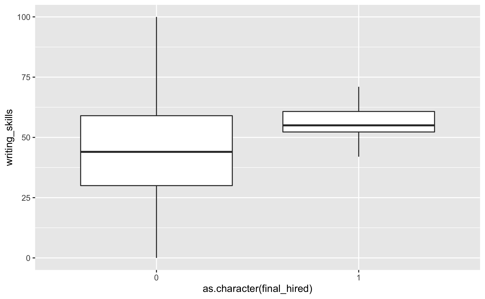

```{r setup, include = FALSE}
library(lmtest)
library(tidyverse)
library(cowplot)
library(lme4)
library(ggpubr)
library(knitr)
library(tableone)
library(broom)
library(psycho)

#install.packages("tableone")

# this should supress all code and messages
knitr::opts_chunk$set(echo = FALSE, message = FALSE)
```

```{r, warning=FALSE}
# Import cleaned data
current <- read_csv("clean/current.csv")
promotion <- read_csv("clean/promotion.csv")
final_hires <- read_csv("clean/final-hires-newgrad_2020.csv")
phase1_new_applicants <- read_csv("clean/phase1_new.csv")
phase2_new_applicants <- read_csv("clean/phase2_new.csv")
phase3_new_applicants <- read_csv("clean/phase3_new.csv")
```

\newpage
# Executive summary

First, we would like to thank your company (Black Saber Software) for providing another opportunity to us (Data Over Flow Co. Ltd.). It has always been a pleasure working with your company. 

As requested from your side, we have formed a team of three experienced analysts to work on this project. Specifically, the team examined the structure of the human resource system of your company by analyzing the provided data on the hiring, promotion and salary information. Our examination yielded the final conclusion that that the hiring and remuneration processes are fair and based on talent and value to the company. 

The key findings are:

- Even though there exists differences between the average salaries of male and female employees, the difference is not evidence of gender bias because multiple variables act as significant confounding variables between gender and salary. For example, men on average have higher seniority levels and hence are compensated with higher salary based on this higher added-value to the company. 


- Among the three phases of recruitments, the chance of successfully landing the job is mostly dependent on other variables such as gpa and work experience. Gender is not found as a significant predicting variable for the chance of success during any of these phases. In other words, candidates with stronger background, talent and potential are selected, regardless of gender. 

- The chances of being promoted is higher for male employees than for female employees, however (...)

Based on our findings, we believe that the company is fair in terms of salary distributions for male and female employees. The hiring process empowered by the AI system is also recruiting the best talent without biasing on any gender. The promotion process is also determined by personal ability and contribution to the company. Any individual salary, promotion or hiring decision is made fairly based on non-gender and ability-related parameters only. Overall, Black Saber Software acts in accordance with the Ontario's Human Rights Code and Black Saber's policies.


\newpage
# Technical report

## Introduction

We assessed the potential existence of bias from three different aspects: salary levels, hiring decisions, and promotions. We used a combination of model building and data visualization techniques to reach our conclusion that there is no bias in the company's hiring and renumeration processes. In the following report, 'the company' refers to the Black Saber Software and 'we' refers to the analysts from Data Over Flow. With no special notes, the assumed level of significance in this report is $\alpha=0.05$.

### Research questions

The three main research questions of the analysis are as follows: 

* Is there a gender bias in the salary levels (remuneration) within the company? 
* Is there a gender bias during the hiring processes of the company? 
* Is there a gender bias in the promotion possibilities within the company? 

## Does there exist bias in current employee renumeration?

In order to analyze whether gender bias exists in the current employee renumeration, we fitted a linear mixed model as well as two general linear models on the dataset containing all current employees at the Black Saber Software. The dataset contains 6909 observations of 9 variables, including all 608 current employees of the Black Saber Software. Each observation records the information of a specific employee at a specific time (a given quarter in a given year). Based on data visualization outputs, the differences between different levels of juniors and seniors are not significant, thus we combined the positions 'Entry-level', 'Junior I', 'Junior II' and 'Junior III' into one category of 'Junior' and combined 'Senior I', 'Senior II', 'Senior III' into another category 'Senior'. 

We consider salary as the key variable to measure employee renumaration and hence used it as the response varible. We want to assess whether an employee's salary is affected by his/her gender in order to detect the existence of bias. On top of that, we included other non-personal variables such as team information, financial quater of the year and seniority of level which are key factors of salary level to reduce potential omitted variable bias between gender and salary. To incorporate both the fixed effetcs and the random effects of variables on the remployee enumaration, we introduced the following linear mixed model:

\begin{equation}
y = X\beta + Zu + \epsilon 
\end{equation}

Linear mixed model considers the response variable y as a vector of observations with $E(y)=X\beta$. $\beta$ is an unknown vector for the fixed effects and u is an unknown vector for the random effects. This model is appropriate when non-independence exists in the data. In our initial model, we consider gender, seniority and the financial quarter as fixed effects. We treat team, leadership for level and productivity score as random effects. Note that random effects are included to work with multiple levels of correlated data. This allows the model to account for both the variability within random effect groups as well as between those groups, which is crucial because our data covers information across various time intervals and hierarchical corporate structure. 

Given that our full model uses all factors, we tried to reduce the number of predictors to find the simplest model that incorporates all the relevant information. By attempting to drop predictors one by one and conducting likelihood ratio tests, we found that all predictors beside "leadership" are significant. Thus, our final model dropped leadership_for_level as a predictor and included all other predictors. The final model gives the following results:

\begin{center}
\captionof{table}{Statistics Summary for Reduced Salary Model}
\begin{tabular}{|l|l|l|l|}
\hline
Variable & $\hat{\beta}$ & Std. Error & p-value \\ \hline
intercept & 116904.03 & 709.18 & 0.99 \\ \hline
women & -2928.38 & 426.88 & $6.06e^{-9}$ \\ \hline
junior & -79703.19 & 342.56 & $8.91e^{-7}$ \\ \hline
manager & -50342.84 & 311.51 & $0.00$ \\ \hline
senior & -69910.72 & 323.8 & $0.01$ \\ \hline
vice-president & 30024.17 & 498.25 & $1.25e^{-12}$ \\ \hline
quarter & 74.31 & 28.28 & $0.01$ \\ \hline
\end{tabular}
\end{center}

Under this model, we predict a positive correlation between seniority level and salary. Given the baseline group as directors, it is reasonable to see any positions below director receives lower salaries and any positions above director receives higher salaries. There appears to be a difference between average salaries of males and females. More specifically holding all else constant, being female reduces the salary by 2953.78 on average. Prior to this model, we also considered the naive model that simply regresses gender on salary without controlling for any variables. The effect found was that being women reduces one's salary by 2680.4. We see that this difference is larger now after eliminating many confounding variables. For further analysis, we fitted three general linear models to check the correlation between gender and productivity:

\begin{equation}
\label{eqn:m1.2}
y_{productivity} = X\beta_{gender}  + \epsilon 
\end{equation}

\begin{equation}
\label{eqn:m1.3}
y_{salary} = X\beta_{gender}  + \epsilon 
\end{equation}

\begin{equation}
\label{eqn:m1.4}
y_{salary} = X\beta_{productivity}  + \epsilon 
\end{equation}

According to \ref{eqn:m1.2}, the average productivity of female employees is 1.46 times higher of male employees holding all other variables constant(p-value = 0.0001). \ref{eqn:m1.4} indicates a negative correlation between productivity score and salary level, or one unit increase in productivity leads to a decrease of 44.73 in salary. Both correlations are significant at the 0.05 level, suggesting that productivity is a significant confounding variable between gender and salary.  

```{r,include=FALSE}
# The main model examine the gender bias, along with other potential biases in current employee remuneration
# Removed "Prefer not to say" from gender since it doesn't provide additional information
# fixed effect: gender, seniority, quarter, productivity
# random effect: team, leadership, employee id
current <- current %>% filter(gender != "Prefer not to say")
model1.1 <- lmer(salary ~ gender + seniority + quarter + productivity + (1|employee_id) + (1|team) + (1|leadership_for_level), data = current)
summary(model1.1)
confint(model1.1)
```

```{r, include = FALSE}
# there exists correlation between gender and productivity according to the data given
model1.2 <- glm(productivity ~ gender, data = current)
kable(tidy(model1.2))
summary(model1.2)
```

```{r, include = FALSE}
#This model shows that there is a difference in salary between male and female, but there might be other reasons why the gap exists
model1.3 <- glm(salary ~ gender, data = current)
kable(tidy(model1.3))
summary(model1.3)
confint(model1.3)
```

```{r, include=FALSE}
# there exists negative correlation between salary and productivity according to the data given
# worth to mention in the report: higher productivity leads to lower salary
model1.4 <- glm(salary ~ productivity, data = current)
kable(tidy(model1.4))
summary(model1.4)
```

```{r, include=FALSE}
# The reduced model from the main model - this can be the final model I think
# Tried seniority, gender, quarter, employeeid, team, productivity for level from the predictors and the reduced model has a worse performance comparing to the full model
# Tried removing leadership_for_level and productivity - the reduced model had a better performance comparing to the original, therefore, it is not necessary to include this predictor into the model

model1.5 <- lmer(salary ~ gender + seniority + quarter + (1|team) + (1|employee_id), data = current)
summary(model1.5)
#confint(model1.5)

# Likelihood ratio test comparing the two models, small p value indicating the second model is better
lmtest::lrtest(model1.1, model1.5)
```


## Does there exist bias in the hiring process?

We assess the bias in the company's hiring process using a hiring dataset. The hiring process contains three phases, where at each phase, different variables are examined by the human resourses department to determine the successfull applicants. Therefore we derive 3 different data sets from the original data and formed data of new applicants at each phase. The variable of interest is whether the candidate made it to the next phase, which is represented by a binary variable. For this reason, we use general linear models with family of binomials to inference the hiring results. The model predicts p in \ref{#eq:logistic} where p is the probability of event A that we are interested in, $\beta_0$is the intercept, $x_1...x_K$ are our variables of interest and $\beta_1...\beta_k$ are parameters for each of these variables.

\begin{equation}
log(\frac{p}{1-p})=\beta_0+\beta_1x_1+...+\beta_kx_k 
\end{equation}

At phase 1, the predicting variables include gpa, whether candidate has extracurricular experience, whether candicate submitted a cover letter and whether candidate has working experience. The results are summarized:

\begin{center}
\captionof{table}{Statistics Summary for Phase 1 Hiring Model}
\begin{tabular}{|l|l|l|l|}
\hline
Variable & $\hat{\beta}$ & Std. Error & p-value \\ \hline
intercept & -25.16 & 648.71 & 0.96 \\ \hline
prefer not to say & 0.16 & 0.85 & 0.84 \\ \hline
women & -0.05 & 0.22 & 0.78 \\ \hline
gpa & 2.09 & 0.23 & $<2e^{-16}$ \\ \hline
extra-curricular & 0.29 & 0.21 & 0.17 \\ \hline
cover letter & -18.68 & 648.7 & 0.97 \\ \hline
work experience & 0.76 & 0.27 & 0.01 \\ \hline
\end{tabular}
\end{center}

According to $\alpha=0.05$, only gpa and work experience affects the result of phase 1, where both variables have a positive relationship with the chance of passing phase 1. Note that gender is not a significant predictor in this model.

```{r, include = FALSE}
phase1_new_applicants
# pass_phase1 ~ gender* cv gpa cover_letter (phase1)
model2.1 <- glm(pass_phase1.x ~ gender + gpa + extracurriculars + cv + work_experience, family = binomial(link = "logit"), data = phase1_new_applicants)
summary(model2.1)
```

At phase 2, the predicting variables include the team which candidate applied for, whether candidate has extracurricular experience, whether candidate has working experience, and three scores representing writing, speaking and technical skills. The results are summarized:

\begin{center}
\captionof{table}{Statistics Summary for Phase 2 Hiring Model}
\begin{tabular}{|l|l|l|l|}
\hline
Variable & $\hat{\beta}$ & Std. Error & p-value \\ \hline
intercept & -24.15 & 4.79 & $4.77e^{-7}$ \\ \hline
prefer not to say & 1974.74 & 0.85 & 0.99 \\ \hline
women & -0.63 & 0.79 & 0.42 \\ \hline
team & 1.4 & 0.76 & 0.06 \\ \hline
extra-curricular & 0.71 & 0.21 & 0.37 \\ \hline
work experience & 0.73 & 0.27 & 0.88 \\ \hline
technical skills & 0.02 & 0.27 & $7.06e^{-5}$ \\ \hline
writing skills & 0.1 & 0.02 & $9.93e^{-5}$ \\ \hline
speaking skills & 0.9 & 0.22 & $9.13e^{-6}$ \\ \hline
leadership presence & 1.00 & 0.21 & $3.73e^{-5}$ \\ \hline
\end{tabular}
\end{center}

According to $\alpha=0.05$,all the skills score and leadership presence affects the result of phase 1, work experience is no longer a predictor for the chance of success at phase 2. 

```{r, include=FALSE}
# pass_phase2 ~ gender* cv gpa cover_letter tech writing speaking (phase2)
# everyone passed phase 1 has cv
model2.2 <- glm(pass_phase2.x ~ gender + team_applied_for + extracurriculars + work_experience + technical_skills + writing_skills + leadership_presence + speaking_skills, family = binomial(link = "logit"), data = phase2_new_applicants)
summary(model2.2)
```

```{r, include = FALSE}
# final_hired ~ gender* cv gpa cover_letter tech writing speaking rating1 rating2 (phase3)
# everyone passed phase 1 has cv
# too few datapoints model can't converge... the only model that can converge is to use gender 
phase3_new_applicants <- phase3_new_applicants %>% mutate(avg = (interviewer_rating_1+interviewer_rating_2)/2)
model2.3 <- glm(final_hired.x.x ~ gender.x, family = binomial(link = "logit"), data = phase3_new_applicants)
summary(model2.3)
#table(phase3_new_applicants$gender, phase3_new_applicants$final_hired)
table(phase3_new_applicants$avg)
```

```{r, include=FALSE}
model2.4 <- glm(final_hired.x ~ gpa, family = binomial(link = "logit"), data = phase1_new_applicants)
summary(model2.4)
```

Phase3 and final TBD

To conclude, each phase of recruitment focuses on difference traits of a candidates, and there is no significant relationship between gender and the rate of success. Besides, there is no significant priority out of the three skills recorded. 

## Is there gender bias in the promotion process?

```{r gender-promotion, fig.cap="The Number of Promotion By Gender"}
promotion %>% ggplot(aes(x = gender, y = promotion)) + geom_boxplot()
```

```{r, include=FALSE}
model3.1 <- glm(promotion ~ gender, data = promotion)
kable(tidy(model3.1))
summary(model3.1)
```

```{r, include=FALSE}
model3.2 <- glm(promotion ~ gender + avg_productivity, data = promotion)
kable(tidy(model3.2))
summary(model3.2)
```

In order to examine the potential bias in promotion, we derived a promotion data set from the data on current employees.
We counted the number of times promoted for each empoyee and made inference on this count using gender. We filtered out those who prefer not to disclose their gender in order to improve the accuracy of inference, which is fine because there are 11 of them out of 608 employees. Figure 1 indicates the number of times being promoted across male and female employees. Observe that the meadian of promotion times for male is higher than the median for females, 1 for males and 0 for females. The employee being promoted the most is male and he got promoted 7 times. 

We fitted a general linear model on the promotion data set using gender as a predictor for the number of times being promoted. The result indicates that female employees is promoted less than male employees, however(...)

## Data Visualization

```{r gender salary, fig.cap="Salary Distribution for Men and Women in Each Quarter", fig.align='center', fig.height=7}
#edit axis label (name)
salary_by_gender_q1 <- current %>% filter(substring(financial_q, nchar(financial_q)) == '1') %>% ggplot(aes(x = gender, y = salary)) + geom_boxplot(aes(colour = gender)) + theme(axis.text.x = element_text(angle = 90, vjust = 0.5, hjust=1))
salary_by_gender_q2 <- current %>% filter(substring(financial_q, nchar(financial_q)) == '1') %>% ggplot(aes(x = gender, y = salary)) + geom_boxplot(aes(colour = gender)) + theme(axis.text.x = element_text(angle = 90, vjust = 0.5, hjust=1))
salary_by_gender_q3 <- current %>% filter(substring(financial_q, nchar(financial_q)) == '1') %>% ggplot(aes(x = gender, y = salary)) + geom_boxplot(aes(colour = gender))+ theme(axis.text.x = element_text(angle = 90, vjust = 0.5, hjust=1))
salary_by_gender_q4 <- current %>% filter(substring(financial_q, nchar(financial_q)) == '1') %>% ggplot(aes(x = gender, y = salary)) + geom_boxplot(aes(colour = gender))+ theme(axis.text.x = element_text(angle = 90, vjust = 0.5, hjust=1))
gender_salary <- plot_grid(salary_by_gender_q1, salary_by_gender_q2, salary_by_gender_q3, salary_by_gender_q4, labels = c("Q1","Q2","Q3","Q4"), ncol = 2, nrow = 2)
gender_salary
```

```{r fig1, fig.cap="Salary Difference Across Leadership for Level Fixing Productivity", fig.align='center'}
ldr_slry <- current %>% 
  filter(financial_q == '2020 Q1') %>% 
  group_by(employee_id) %>% 
  ggplot(aes(x = productivity, y = salary, color = as.factor(leadership_for_level)))+
  geom_point()+
  labs(color = "Leadership for Level")
ldr_slry
```

```{r, message=FALSE, fig.cap="Salary Difference Across Role Seniority", fig.align='center'}
lvl_slry <- current %>% 
  filter(financial_q == '2020 Q1') %>% 
  group_by(employee_id) %>% 
  ggplot(aes(x = productivity, y = salary, color = as.factor(role_seniority)))+
  geom_point()+
    labs(color = "Seniority")
lvl_slry
```

```{r, message=FALSE, fig.cap="Salary Difference Across Leadership Levels"}
pro_slry <- current %>% 
  filter(financial_q == '2020 Q1') %>% 
  group_by(employee_id) %>% 
  ggplot(aes(x = productivity, y = salary, color = as.factor(gender)))+
  geom_point()+
  labs(color = "gender")
pro_slry
```


```{r, fig.cap="Salary Difference in Gender Across Teams, Fixing Quater and Seniority(Entry Level)"}
current %>% 
  filter(financial_q == '2020 Q4') %>% 
  filter(role_seniority == 'Entry-level') %>% 
  group_by(employee_id) %>% 
  ggplot(aes(x = team, y = salary, color = as.factor(gender)))+
  geom_point()+ theme(axis.text.x = element_text(angle = 45, vjust = 0.5, hjust=1))+
  labs(color = "gender")
#ggsave("images/leadership_salary_Q1.png", width = 7, height = 4)
```


```{r, fig.cap="Salary Difference in Gender Across Teams, Fixing Quater and Seniority(Junior I)"}
current %>% 
  filter(financial_q == '2020 Q4') %>% 
  filter(role_seniority == 'Junior I') %>% 
  group_by(employee_id) %>% 
  ggplot(aes(x = team, y = salary, color = as.factor(gender)))+
  geom_point()+ theme(axis.text.x = element_text(angle = 45, vjust = 0.5, hjust=1))+
  labs(color = "gender")
```


```{r, fig.cap="Salary Difference in Gender Across Teams, Fixing Quater and Seniority(Junior II)"}
current %>% 
  filter(financial_q == '2020 Q4') %>% 
  filter(role_seniority == 'Senior I') %>% 
  group_by(employee_id) %>% 
  ggplot(aes(x = team, y = salary, color = as.factor(gender)))+
  geom_point()+ theme(axis.text.x = element_text(angle = 45, vjust = 0.5, hjust=1))+
  labs(color = "gender")
```


```{r, fig.cap="Salary Difference in Gender Across Teams, Fixing Quater and Seniority(Manager)"}
current %>% 
  filter(financial_q == '2020 Q4') %>% 
  filter(role_seniority == 'Manager') %>% 
  group_by(employee_id) %>% 
  ggplot(aes(x = team, y = salary, color = as.factor(gender)))+
  geom_point()+ theme(axis.text.x = element_text(angle = 45, vjust = 0.5, hjust=1))+
  labs(color = "gender")
```

```{r, fig.cap="Salary Difference in Gender Across Leadership for Level"}
current %>% 
  group_by(employee_id) %>% 
  ggplot(aes(x = leadership_for_level, y = salary, color = as.factor(gender)))+
  geom_point()+
  labs(color = "gender")+
  xlab("leadership for level")+ theme(axis.text.x = element_text(angle = 45, vjust = 0.5, hjust=1))+
  labs(color = "gender")
```


```{r, fig.cap="Salary Difference in Gender Across Seniority"}
current %>% 
  group_by(employee_id) %>% 
  ggplot(aes(x = role_seniority, y = salary, color = as.factor(gender)))+
  geom_point()+ theme(axis.text.x = element_text(angle = 45, vjust = 0.5, hjust=1))+
  labs(color = "gender")+
  xlab("seniority")
```

```{r, fig.cap="Salary Difference in Gender Across Teams"}
current %>% 
  group_by(employee_id) %>% 
  ggplot(aes(x = team, y = salary, color = as.factor(gender)))+
  geom_point()+ theme(axis.text.x = element_text(angle = 45, vjust = 0.5, hjust=1))+
  labs(color = "gender")
```

```{r, fig.cap="GPA Distribution Across Phase1 Applicants"}
phase1_new_applicants %>% ggplot(aes(x = as.character(gender), y = gpa)) + geom_boxplot()+
  xlab("gender")
#ggsave("images/gpa_hiring.png", gpa_if_hired)
```


```{r, fig.cap="GPA Distribtion Across Hiring Results"}
# gpa_if_hired <- phase1_new_applicants %>% ggplot(aes(x = as.character(final_hired), y = gpa)) + geom_boxplot()+
  xlab("hiring results")
# gpa_if_hired
```

```{r, fig.cap="GPA Distribution Across Phase1 Results"}
# gpa_if_pass_phase1 <- phase1_new_applicants %>% ggplot(aes(x = as.character(pass_phase1), y = gpa)) + geom_boxplot()+
#   xlab("phase1 results")
# gpa_if_pass_phase1
```

```{r, fig.cap="Speaking Skills Score Across Hiring Results"}
#same scale 
# phase2_new_applicants %>% ggplot(aes(x = as.character(final_hired), y = speaking_skills)) + geom_boxplot()+
#   xlab("hiring results")+ylab("speaking skills score")
```

```{r, fig.cap="Speaking Skills Score Across Phase2 Results"}
#same scale 
# phase2_new_applicants %>% ggplot(aes(x = as.character(pass_phase2), y = speaking_skills)) + geom_boxplot()+
  # xlab("phase2 results")+ylab("speaking skills score")
```

### Writing Skills VS if hired
```{r, fig.cap="Writing Skills Score Across Hiring Results"}
# phase2_new_applicants %>% ggplot(aes(x = as.character(final_hired), y = writing_skills)) + geom_boxplot()+
  # xlab("hiring results")+ylab("writing skills score")
```

```{r, fig.cap="Writing Skills Score Across Phase2 Results"}
# phase2_new_applicants %>% ggplot(aes(x = as.character(pass_phase2), y = writing_skills)) + geom_boxplot()+
  # xlab("phase2 results")+ylab("writing skills score")
```


```{r, fig.cap="Technical Skills Score Across Hiring Results"}
# phase2_new_applicants %>% ggplot(aes(x = as.character(final_hired), y = technical_skills)) + geom_boxplot()+
  # xlab("hiring results")+ylab("technical skills score")
```


```{r}
# phase1_new_applicants %>% 
  # filter(final_hired == '1') %>% 
  # group_by(applicant_id) %>% 
  # ggplot(aes(x = gender, y = gpa))+
  # geom_point()
```


```{r}
# phase2_new_applicants %>% 
  # filter(final_hired == '1') %>% 
  # group_by(applicant_id) %>% 
  # ggplot(aes(x = gender, y = technical_skills))+
  # geom_point()
```


```{r}
# phase2_new_applicants %>% 
  # filter(final_hired == '1') %>% 
  # group_by(applicant_id) %>% 
  # ggplot(aes(x = gender, y = writing_skills))+
  # geom_point()
```


```{r}
# phase2_new_applicants %>% 
  # filter(final_hired == '1') %>% 
  # group_by(applicant_id) %>% 
  # ggplot(aes(x = gender, y = speaking_skills))+
  # geom_point()

```


## Discussion

_In this section you will summarize your findings across all the research questions and discuss the strengths and limitations of your work. It doesn't have to be long, but keep in mind that often people will just skim the intro and the discussion of a document like this, so make sure it is useful as a semi-standalone section (doesn't have to be completely standalone like the executive summary)._

### Strengths and limitations
- The size of final hires data set is too small for inference. For data of this size(22 observations), inference of anykind is not meaningful. Alternatively, we rely on data visualization to come up with our conclusion. 


\newpage
# Consultant information
## Consultant profiles

**Rain Wu**. Rain is a senior consultant with DataOverFlow. She specializes in data visualization. Rain earned her Bachelor of Science, Specialist in Statistics Methods and Practice, from the University of Toronto in 2022. Before joining DataOverFlow, Rain has 3 year of working experience as a data engineer at Aviva in Markham, Toronto. 

**Tina Wang**. Tina is a junior consultant with DataOverFlow. She specializes in reproducible analysis. Tina earned her Bachelor of Science, Majoring in Computer Science and Statistics from the University of Toronto in 2022. Tina earned her master degree in financial insurance from the University of Toronto in 2024.

**Yiqu Ding**. Yiqu is a junior consultant with DataOverFlow. She specializes in statistical communication. Yiqu earned her Bachelor of Science, Majoring in Statistics and mathmatical application in finance and economics from the University of Toronto in 2022. Yiqu earned her master degree in financial insurance from the University of Toronto in 2024.

## Code of ethical conduct

* We respect and protect confidential data obtained from, or relating to, clients and third parties, as well as personal data and information about about employees from Data Over Flow. We only share information when there is a business purpose, and then do so in accordance with applicable laws and professional standards.
*	We take proactive measures to safeguard our archives, computers and other data-storage devices containing confidential information or personal data. We promptly report any loss, damage or inapproprita disclosure of confidential information or personal data. 
* We use social media and technology in a responsible way and respect everyone we work with. We obtain, develop and protect intellectual capital in an appropriate manner. We respect the resrtictions on its use and reproduction. 